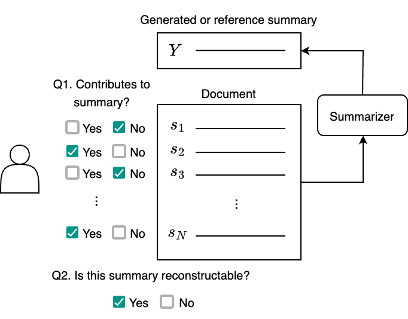

# SourceSum: Source Identification in Abstractive Summarization

This repository contains the data and code for the paper [Source Identification in Abstractive Summarization](https://arxiv.org/abs/2402.04677) accepted at EACL 2024.

## Overview

**SourceSum** is a benchmark for the source sentence detection task, which detects source sentences for a summary generated by an abstractive summarization model. The dataset consists of 4 sets. 

| Set              | # pairs | # sentences | # source sentences | Input length | Summary length |
|------------------|---------|-------------|--------------------|--------------|----------------|
| XSum-PEGASUS     | 119     | 10.28       | 3.09 (30.1%)       | 275.09       | 19.51          |
| XSum-Reference   | 119     | 10.28       | 3.40 (33.1%)       | 275.09       | 23.71          |
| CNN/DM-PEGASUS   | 468     | 11.58       | 1.72 (14.9%)       | 309.07       | 16.95          |
| CNN/DM-Reference | 505     | 11.56       | 2.03 (17.6%)       | 305.79       | 15.87          |

The figure below depicts the annotation flow for SourceSum. For each document-summary pair, the human annotator is asked to annotate each sentence (Q1), followed by the reconstructability question (Q2).



Please see the [paper](https://arxiv.org/abs/2402.04677) for the details.

## Data

Source sentence and reconstructibility annotations are stored in the JSON format for XSum (`xsum_*`) and CNN/DailyMail (`cnn_*`) separately. `_pegasus` and `_reference` denote whether generated or reference summaries are used. `*_all.json` contains all annotations for all document-summary pairs before filtering by the reconstructibility.

```
.
├── README.md
├── data
│   ├── cnn_pegasus.json
│   ├── cnn_pegasus_all.json
│   ├── cnn_reference.json
│   ├── cnn_reference_all.json
│   ├── xsum_pegasus.json
│   ├── xsum_pegasus_all.json
│   ├── xsum_reference.json
│   └── xsum_reference_all.json
└── scripts
```


### Format

Each file stores `List[Dict]` in a JSON format. Each entry follows the schema below.

- `id: str`: Unique ID (e.g., `xsum__train__15555406__pegasus-xsum__0`)
- `corpus: str`: Name of the original corpus (`xsum` or `cnn`)
- `split`: Split name in the original dataset (`train` or `validation` or `test`)
- `model`: Name of the model used to obtain the summary (e.g., `pegasus-xsum` or `reference`)
- `original_id`: ID in the original dataset.
- `annotations`: `List[Dict]`
    - `sentence_idx: int`: Sentence index (0 origin)
    - `sentence: str`: Sentence text
    - `pos: List[int]`: Beginning and end positions of the sentence
    - `label: List[int]`: Source sentence annotation (annotations by at least two annotators) (`0`: does not contribute to the summary, `1`: contributes to the summary)
- `document: str`: Original document
- `ref_summary: str`: Reference summary (all sentences)
- `gen_summary: str`: Generated summary sentence. If `model=="reference"`, it is **a sentence** (not all the summary) of the reference summary.
- `summary_idx: int`: Sentence index of `gen_summary`
- `rel_sent_positions: List[int]`: List of source sentences indexes

Here is an example entry from `data/xsum_pegasus.json`

```
[
  {
    "id": "xsum__train__15555406__pegasus-xsum__0",
    "corpus": "xsum",
    "split": "train",
    "model": "pegasus-xsum",
    "original_id": "15555406",
    "annotations": [
      {
        "sentence_idx": 0,
        "sentence": "Dan Roan is our sports editor and focuses on the major events and news stories.",
        "pos": [
          0,
          79
        ],
        "label": [
          1,
          1
        ]
      },
      {
        "sentence_idx": 1,
        "sentence": "Tom Fordyce is our chief sports writer who specialises in cricket, rugby, tennis and athletics. His strength is providing the background to major events and the extraordinary people who compete in them.",
        "pos": [
          80,
          282
        ],
        "label": [
          1,
          1
        ]
      },
      ...
      {
        "sentence_idx": 13,
        "sentence": "Cornelius Lysaght is our horse racing expert, well known as a correspondent on Radio 5 live.",
        "pos": [
          1874,
          1966
        ],
        "label": [
          1,
          1
        ]
      }
    ],
    "summary_label": [
      1,
      1
    ],
    "document": "Dan Roan is our sports editor and focuses on the major events and news stories.\nTom Fordyce is our chief sports writer who specialises in cricket, rugby, tennis and athletics. His strength is providing the background to major events and the extraordinary people who compete in them.\nRichard Conway is BBC Radio 5 live's sports news correspondent, providing in-depth analysis and coverage across a wide range of sports.\nAndy Swiss is a sports new correspondent, he has covered the Olympics and Paralympics and writes regular features on disability sport.\nPhil McNulty is our chief football writer, reporting on the biggest matches and breaking football stories.\nDan Walker presents Football Focus but also covers many of the BBC's biggest sporting events, from Wimbledon and the Open to the Six Nations and the Grand National.\nTim Vickery is our South American football expert, keeping tabs on the next generation of players who will soon be gracing La Liga, Serie A and the Premier League.\nAndrew Benson has been covering Formula 1 for nearly 20 years, taking in more than 100 grands prix. His contacts within the sport make him the definitive source for all your F1 news.\nJonathan Agnew has been a regular on Test Match Special since 1991. The former Leicestershire and England bowler gives his opinion and analysis via his correspondent page.\nIain Carter is 5 live's golf correspondent and brings you all the latest from the course, as well as the gossip from the 19th hole.\nRussell Fuller is the BBC tennis correspondent and brings all the latest news and analysis from each of the four Grand Slams and the rest of the tour throughout the season.\nThe Rugby Union index pulls together the latest blog offerings from the BBC Sport team and Tom Fordyce.\nGeorge Riley presents 5 live Breakfast's sports bulletins, but on top of that he is our main man covering Rugby League.\nCornelius Lysaght is our horse racing expert, well known as a correspondent on Radio 5 live.",
    "ref_summary": "The BBC Sport team brings you comprehensive analysis of the world's biggest sports events and stories:",
    "gen_summary": "The BBC Sport team brings you all the latest news and analysis from the world of sport.",
    "summary_idx": 0,
    "rel_sent_positions": [
      1,
      2,
      3,
      4,
      5,
      6,
      7,
      8,
      9,
      10,
      11,
      12,
      13,
      14
    ]
  },
   ...
 ]
```


## Code & Files

### Rerunning evaluation

The calculated results in the paper are hosted in the repo. If you'd like to run the evaluation by yourself, you can use the following scripts.

- evaluate_{xsum|cnn}.py
- evaluate.py
- create_report.py

Simply run `make` will reproduce all experiments.

```
$ make
```

Please see `Makefile` for examples of how to run the scripts.


### Score files

`outputs/{xsum|cnn}_{pegasus|reference}__${method}.json` contains scores calculated by ${method} (`["lexrank", "rouge1", "berscore", "attention", "perplexity"]`).
The score is added as an additional entry in each sentence (`Dict`) in the `annotations` field in the same format as the original data files. 


```
...
    "annotations": [
      {
        "sentence_idx": 0,
        "sentence": "Dan Roan is our sports editor and focuses on the major events and news stories.",
        "pos": [
          0,
          79
        ],
        "label": [
          1,
          1
        ],
        "lexrank": 1.2199,
      },
...
```


### Evaluation files

`outputs/{xsum|cnn}_{pegasus|reference}__${method}__eval.csv` contains NDCG and AP values for each sample in a CSV format, which can be loaded as a DataFrame using `pd.read_csv()`.


### Report files

`outputs/{xsum|cnn}_{pegasus|reference}__report.csv` is an aggregated version of `__eval.csv` files described above.


## Citation

```
@misc{suhara2024source,
      title={Source Identification in Abstractive Summarization}, 
      author={Yoshi Suhara and Dimitris Alikaniotis},
      year={2024},
      eprint={2402.04677},
      archivePrefix={arXiv},
      primaryClass={cs.CL}
}
```

